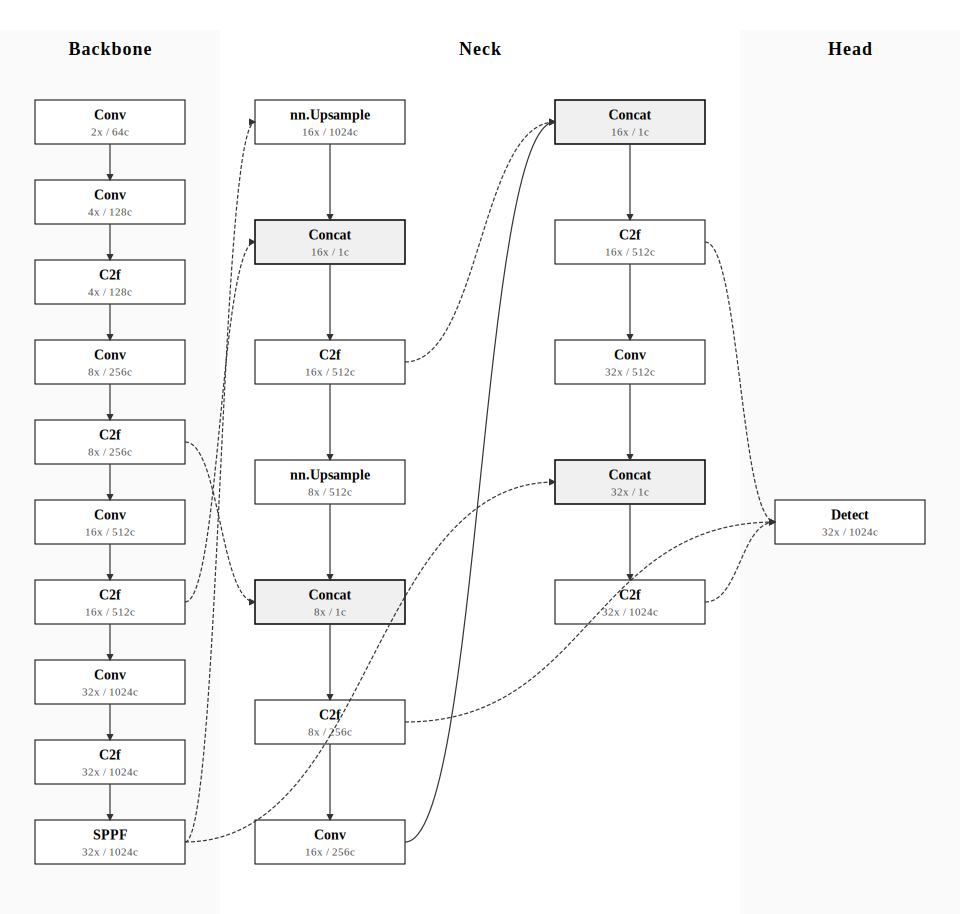
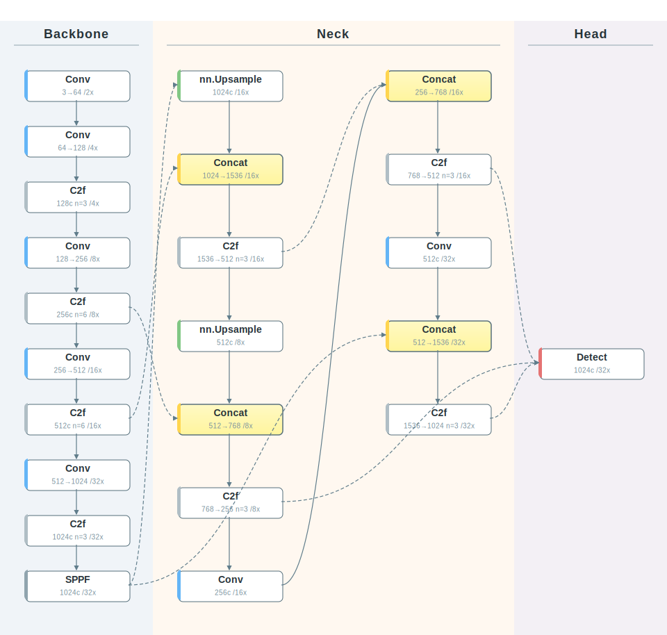
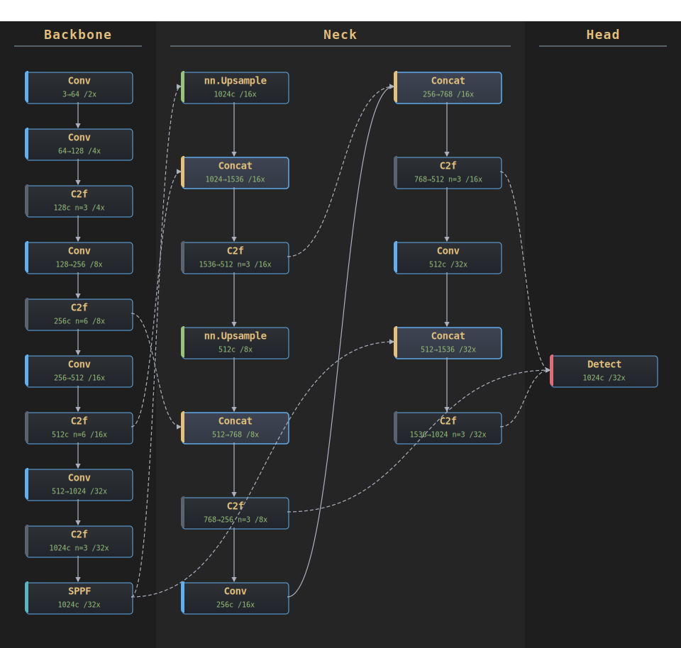
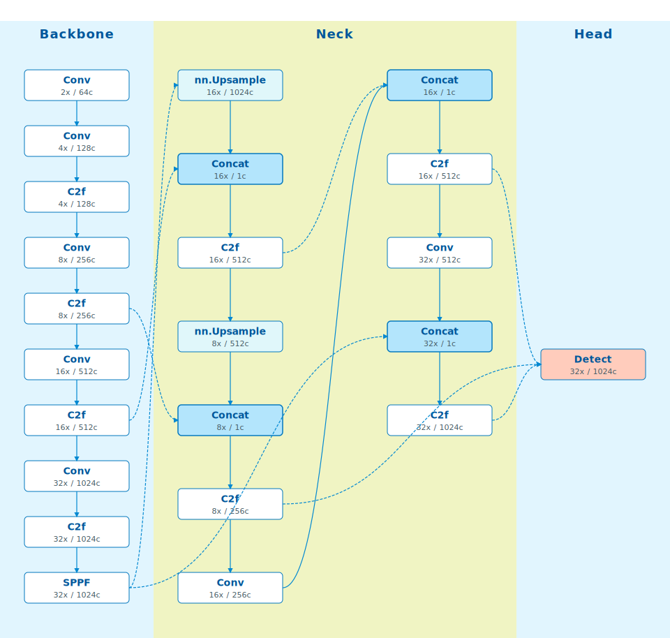
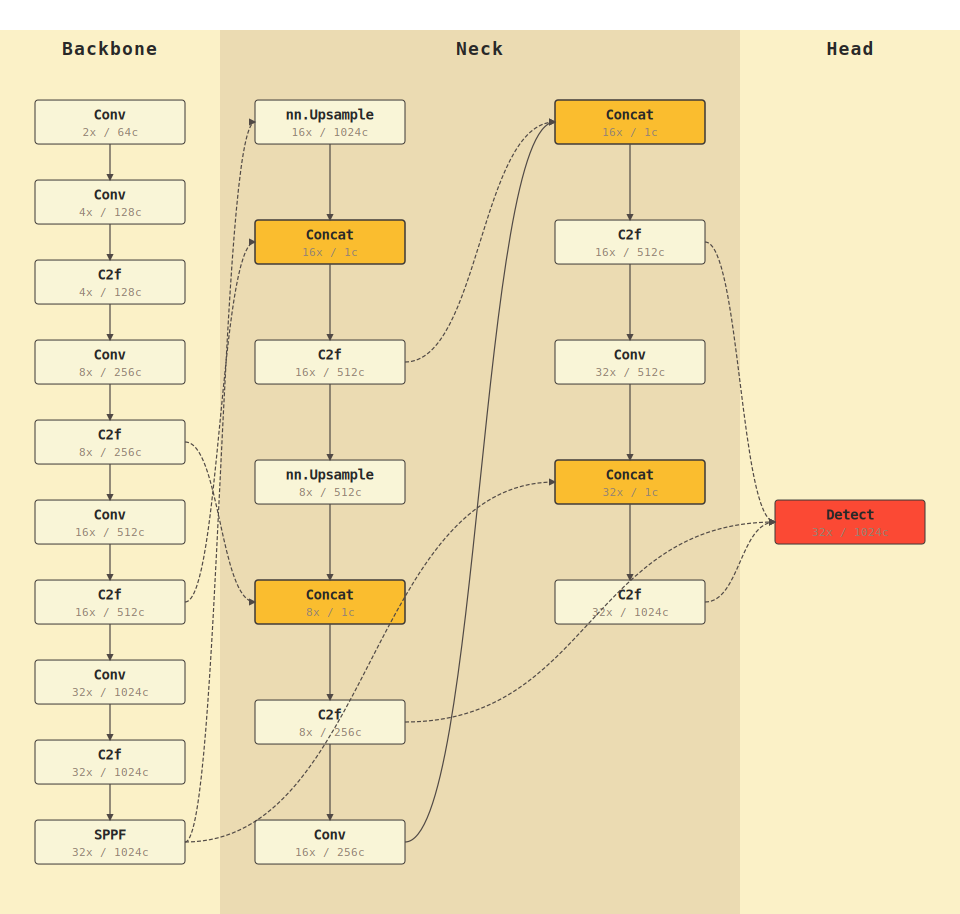
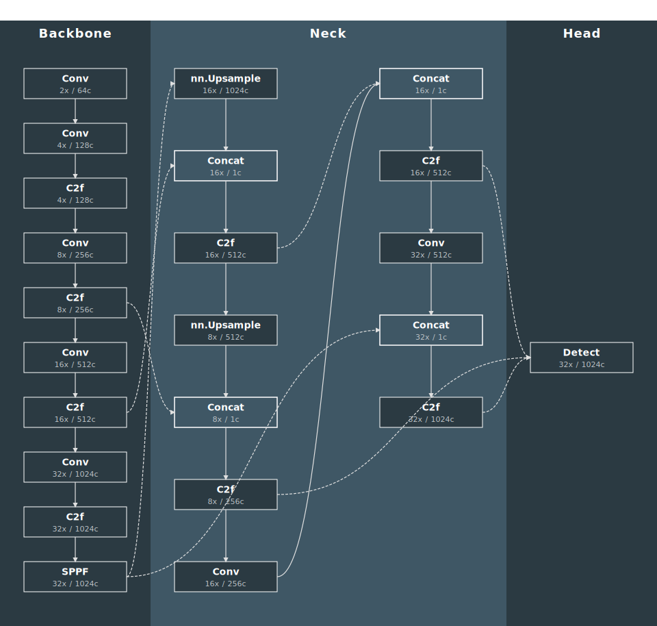
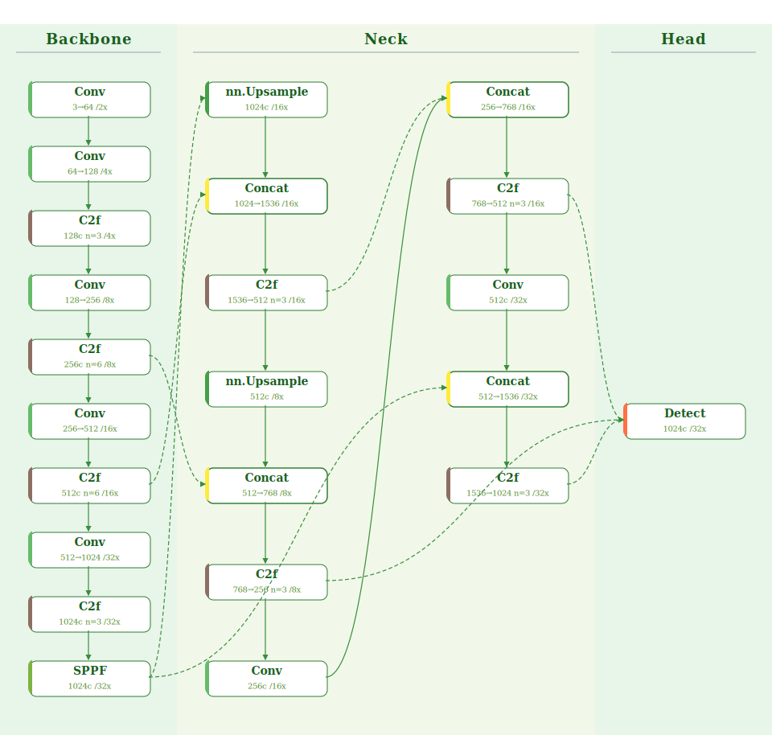
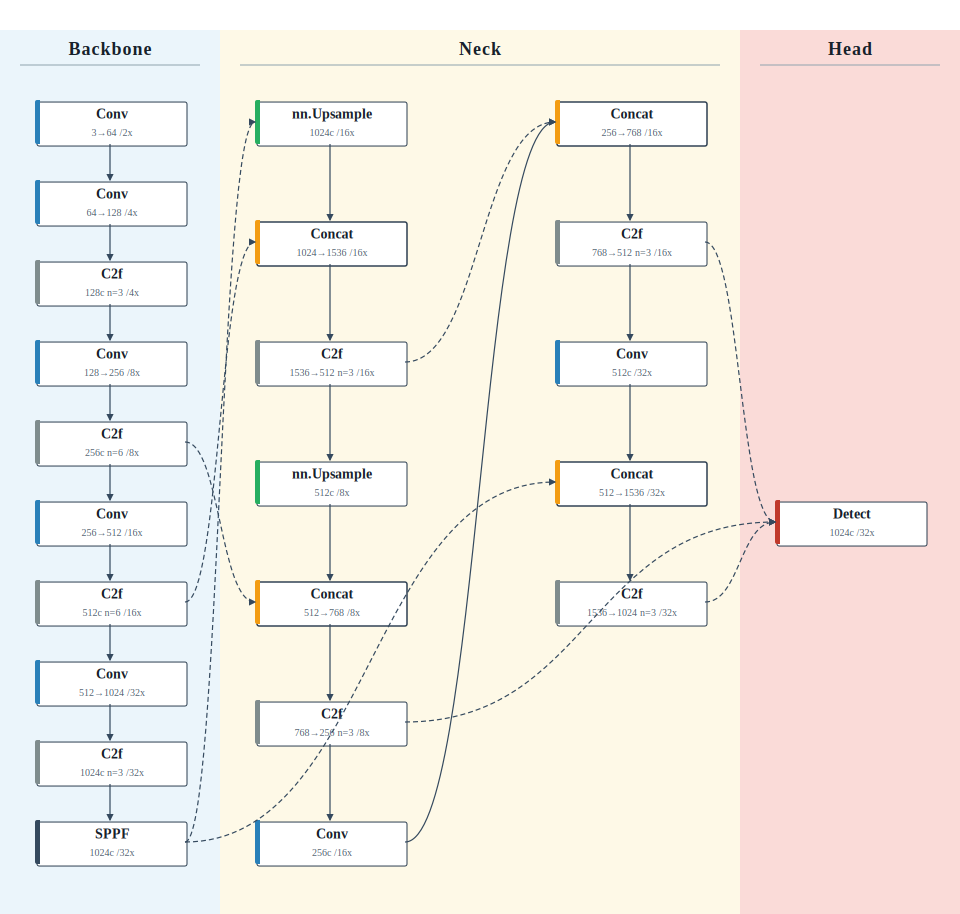

# YAML2ModelGraph v1.0

<div align="right">

[English](README_EN.md) | [中文](README.md)

</div>

[](https://www.python.org/)  
[](LICENSE)

---

## 📖 Introduction

**YAML2ModelGraph v1.0** is a professional YOLO model architecture visualization tool that automatically converts Ultralytics YOLO model YAML configuration files into beautiful SVG architecture diagrams.

### ✨ Key Features

- 🎨 **9 Beautiful Themes**: From academic paper style to modern candy colors, meeting different scenario needs
- 📐 **Smart Layout**: Automatically identifies Backbone, Neck, and Head modules with intelligent multi-column folding
- 🔗 **Clear Connections**: Supports multiple connection styles (straight lines, Bézier curves, Manhattan routing)
- 📊 **Rich Information**: Displays module types, stride, channel numbers, and other key information
- 🎯 **Ready to Use**: No additional dependencies required, pure Python + SVG output

---

## 🖼️ Theme Showcase

<div align="center">

### 9 Theme Styles Overview

<table>
<tr>
<td align="center"><b>Paper</b><br/>Academic Standard</td>
<td align="center"><b>Candy</b><br/>Modern Candy</td>
<td align="center"><b>Dark</b><br/>Dark Geek</td>
</tr>
<tr>
<td></td>
<td></td>
<td></td>
</tr>
<tr>
<td align="center"><b>Ocean</b><br/>Tech Ocean</td>
<td align="center"><b>Retro</b><br/>Retro Warm</td>
<td align="center"><b>Blueprint</b><br/>Engineering Blueprint</td>
</tr>
<tr>
<td></td>
<td></td>
<td></td>
</tr>
<tr>
<td align="center"><b>Forest</b><br/>Forest Nature</td>
<td align="center"><b>Paper RYB</b><br/>Academic RYB ⭐</td>
<td align="center"><b>Journal</b><br/>Modern Journal</td>
</tr>
<tr>
<td></td>
<td></td>
<td></td>
</tr>
</table>

> 💡 **Tip**: All theme SVG files are located in the `svg/` directory and can be viewed directly or used in papers/documents

</div>

---

## 🚀 Quick Start

### Install Dependencies

```bash
pip install pyyaml
```

### Basic Usage

```bash
python main.py examples/yolov8.yaml output.svg --theme paper
```

**Parameters:**
- `examples/yolov8.yaml`: Input YAML model configuration file
- `output.svg`: Output SVG file path (optional, defaults to `yolo_graph.svg`)
- `--theme paper`: Select theme style (optional, defaults to `paper`)

---

## 🎨 Theme Styles

v1.0 provides **9 carefully designed themes** for different scenarios:

### 1. Academic Standard (Paper) - Default Theme

**Features:** Black, white, and gray color scheme, Times New Roman font, minimalist lines  
**Use Case:** Designed specifically for IEEE / CVPR / thesis illustrations, best print quality

```bash
python main.py examples/yolov8.yaml svg/graph_paper.svg --theme paper
```

### 2. Modern Candy (Candy)

**Features:** Morandi color palette (light blue/orange), large rounded corners, sans-serif font  
**Use Case:** Suitable for PPT presentations, technical blogs, posters, visually vibrant and modern

```bash
python main.py examples/yolov8.yaml svg/graph_candy.svg --theme candy
```

### 3. Dark Geek (Dark)

**Features:** Dark background, high contrast lines, code-style font  
**Use Case:** Suitable for dark mode reading, screen presentations, showcasing "hardcore" technical feel

```bash
python main.py examples/yolov8.yaml svg/graph_dark.svg --theme dark
```

### 4. Tech Ocean (Ocean)

**Features:** Various shades of blue tones, fresh and professional  
**Use Case:** Suitable for business presentations, tech company whitepapers

```bash
python main.py examples/yolov8.yaml svg/graph_ocean.svg --theme ocean
```

### 5. Retro Warm (Retro)

**Features:** Warm beige background (Gruvbox style), typewriter font  
**Use Case:** Suitable for long reading sessions (eye-friendly), documents pursuing retro artistic feel

```bash
python main.py examples/yolov8.yaml svg/graph_retro.svg --theme retro
```

### 6. Engineering Blueprint (Blueprint)

**Features:** Deep blue background, white fine lines, CAD engineering font  
**Use Case:** Showcasing "architecture design" and "underlying logic" in hardcore engineering diagrams

```bash
python main.py examples/yolov8.yaml svg/graph_blueprint.svg --theme blueprint
```

### 7. Forest Nature (Forest)

**Features:** Green color scheme, fresh and natural  
**Use Case:** Eye-friendly style, or for emphasizing environmental/lightweight themes

```bash
python main.py examples/yolov8.yaml svg/graph_forest.svg --theme forest
```

### 8. Academic RYB (Paper RYB) ⭐ Recommended

**Features:** Classic red-yellow-blue color scheme with extremely low saturation, clear module distinction  
**Use Case:** Suitable for paper illustrations that need clear distinction between Backbone/Neck/Head module structures

```bash
python main.py examples/yolov8.yaml svg/graph_paper_ryb.svg --theme paper_ryb
```

### 9. Modern Journal (Journal)

**Features:** Minimalist cool style, almost invisible background, most rigorous academic style  
**Use Case:** Suitable for Springer or Nature sub-journal chart styles

```bash
python main.py examples/yolov8.yaml svg/graph_journal.svg --theme journal
```

---

## 📋 Feature Details

### Automatic Module Recognition

The tool automatically recognizes module types in YAML configurations, including:
- **Backbone Modules**: Conv, C2f, SPPF, etc.
- **Neck Modules**: Upsample, Concat, C2f, etc.
- **Head Modules**: Detect, etc.

### Smart Layout Algorithm

- **Backbone**: Single-column vertical layout, clearly showing feature extraction flow
- **Neck**: Intelligent multi-column folding, automatically splits into columns when modules are too many
- **Head**: Automatically aligns based on input sources, maintaining visual coherence

### Connection Styles

- **Vertical Straight**: Adjacent modules in the same column use straight lines
- **Bézier Curves**: Cross-column connections use smooth curves
- **Manhattan Routing**: Backbone to Neck uses right-angle routing
- **Dashed Lines**: Cross-module or long-distance connections use dashed lines

### Information Display

Each node displays:
- **Main Label**: Module type (e.g., Conv, C2f, Detect)
- **Sub Label**: Stride and channel number (e.g., `8x / 256c`)

---

## 📁 Project Structure

```
YAML2ModelGraph/
├── main.py              # Main program entry
├── yolo_graph.py        # Core parsing and layout logic
├── themes.py            # Theme configuration definitions
├── README.md            # Project documentation (Chinese)
├── README_EN.md         # Project documentation (English)
├── examples/            # Example YAML files
│   ├── yolov8.yaml
│   ├── yolo11.yaml
│   ├── yolo12.yaml
│   └── yolov9s.yaml
└── svg/                 # Generated SVG examples
    ├── graph_paper.svg
    ├── graph_candy.svg
    ├── graph_dark.svg
    ├── graph_ocean.svg
    ├── graph_retro.svg
    ├── graph_blueprint.svg
    ├── graph_forest.svg
    ├── graph_paper_ryb.svg
    └── graph_journal.svg
```

---

## 🔧 Advanced Usage

### Custom Themes

Edit the `themes.py` file to:
- Modify existing theme colors, fonts, corner radius, etc.
- Add new theme configurations
- Adjust layout parameters (node size, spacing, etc.)

### Supported YAML Format

The tool is compatible with Ultralytics YOLO series YAML format:

```yaml
backbone:
  - [-1, 1, Conv, [64, 3, 2]]
  - [-1, 3, C2f, [128, True]]
  # ...

head:
  - [-1, 1, nn.Upsample, [None, 2, "nearest"]]
  - [[-1, 6], 1, Concat, [1]]
  # ...
```

---

## 📸 Preview

All theme example images are saved in the `svg/` directory. You can directly view the visual effects of different themes.

---

## 🤝 Contributing

Welcome to submit Issues and Pull Requests!

**Possible Improvement Directions:**
- Add more theme styles
- Support custom node styles
- Optimize layout algorithms for complex models
- Add interactive SVG features

---

## 📄 License

This project uses the **MIT License**, allowing commercial use, modification, and distribution.

---

## 🙏 Acknowledgments

Thanks to the Ultralytics team for providing the YOLO framework and model definition format.

---

**Version:** v1.0  
**Last Updated:** 2024

